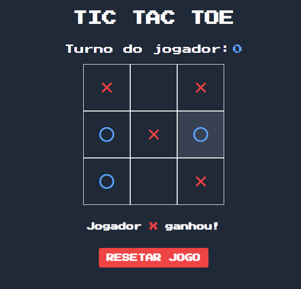
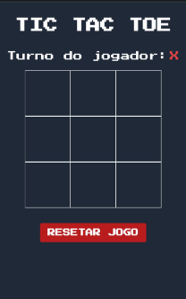

<a id="top">

# Projetos em Vue.Js 💚

</a>

    <a href="#projects">Projetos</a>&nbsp;&nbsp;&nbsp;|&nbsp;&nbsp;&nbsp;
    <a href="#autor">Autor</a>&nbsp;&nbsp;&nbsp;|&nbsp;&nbsp;&nbsp;
    <a href="#info">Informações</a>&nbsp;&nbsp;&nbsp;

---

### 🎯 Breve Resumo

Repositório criado para exibição de projetos feitos usando **Vue.js**.

#### Descrição:

- Jogos, Landing Pages;
- Consumo de apis;
- Todos muito bem documentados;

---

## 👾 Projetos 

#### ❌⭕ Tic Tac Toe

Projeto feito com **Vue.js**(composition api) e **TailwindCss**, que consiste em um jogo da velha de dois jogadores, veja o projeto aqui: [Projeto](https://projetos-vue-js.vercel.app/).

#### Mobile Screenshot:

---

  
### 🚧 Projetos em fase de Construção...⏳
##### Mais projetos em breve...

---

### 👤 Autor 

**Savio Nascimento**

- 
- 

---

### ℹ️ Informações 

 

[⬆️ Topo](#top)  
